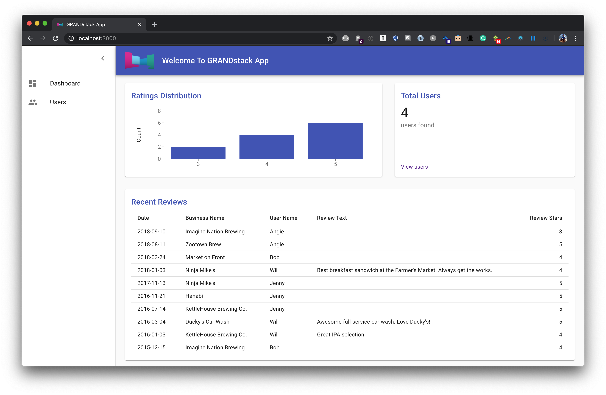

# Pergola FullStack


## Quickstart

The easiest way to get started with the Pergolga Stack is to create a Neo4j Sandbox instance and populate the database with example data 

(If you have a running Neo4j database on localhost via Neo4j Desktop or a Neo4j server installation, change the password in `api/.env`)

### 1. Checkout submodules


```
git submodule update --init --recursive
```

### 2. Install dependencies 

```
yarn install && yarn run install
```

### 3. Seed the database (optional)

Make sure your application is running locally with `yarn start`, open another terminal and run

```
yarn run seedDb
```

### 4. Open In Browser

[localhost:3000](http://localhost:3000/)

## Overview

The Pergola Starter is a monorepo that includes a GraphQL API application and client web applications for React (default) and Angular for a business reviews dashboard.

### `/` - Project Root

The root directory contains some global configuration and scripts:

- `npm run start` and `npm run build`
- Git hooks for applying formatting on commit

### [`/api`](./api)


This directory contains the GraphQL API application using Apollo Server and neo4j-graphql.js.

- ESLint (.eslintrc.json) for code linting
- Prettier (.prettierrc.json) for code formatting
- Change environment variable settings in `.env`:

```
# Use this file to set environment variables with credentials and configuration options
# This file is provided as an example and should be replaced with your own values
# You probably don't want to check this into version control!

NEO4J_URI=bolt://localhost:7687
NEO4J_USER=neo4j
NEO4J_PASSWORD=letmein

# Uncomment this line to enable encrypted driver connection for Neo4j
#NEO4J_ENCRYPTED=true

# Uncomment this line to specify a specific Neo4j database (v4.x+ only)
#NEO4J_DATABASE=neo4j

GRAPHQL_SERVER_HOST=0.0.0.0
GRAPHQL_SERVER_PORT=4001
GRAPHQL_SERVER_PATH=/graphql

```

You can open the GraphQL Playground in the Browser with the url [localhost:4001/playground](http://localhost:4001/graphql)


### [`/frontend`](./frontend)



The frontend for Pergola 

It includes:

- UI Framework (to be decided)
    - Material UI
    - Framework7
- React router
- Apollo Client / React Hooks
- ESLint (.eslintrc.json) for code linting
- Prettier (.prettierrc.json) for code formatting


## Docker Compose

You can quickly start via:

```
docker-compose up -d
```

If you want to load the example DB after the services have been started:

```
yarn run seedDb
```

You can find instructions for other ways to use Neo4j (Neo4j Desktop, Neo4j Aura, and other cloud services) in the [Neo4j directory README.](./neo4j)

## Forked from Template

Initially created using:

```
npx create-grandstack-app myNewApp
```

This project was build using a starter for building a [GRANDstack](https://grandstack.io) (GraphQL, React, Apollo, Neo4j Database) application. There are two components to the starter, the web frontend application (in React and Angular flavors) and the API app (GraphQL server).

[Hands On With The GRANDstack Starter](http://www.youtube.com/watch?v=1JLs166lPc)

